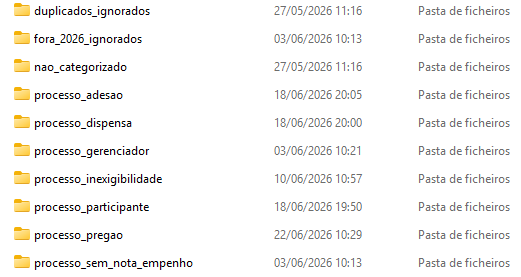
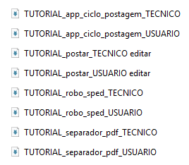

# Sistema de Automação do Ciclo de Postagem de Processos Públicos

Sistema desenvolvido em Python para automatizar etapas repetitivas de um fluxo administrativo envolvendo download, tratamento, separação, organização e postagem de documentos em PDF.

O projeto foi criado com o objetivo de reduzir retrabalho, padronizar processos, aumentar a produtividade e centralizar tarefas operacionais em uma interface simples, executada por botões.

> **Aviso:** Este projeto foi adaptado para fins de portfólio. Dados reais, credenciais, documentos oficiais, caminhos internos, CPF, CNPJ e números de processos foram removidos ou substituídos por exemplos fictícios.

---

## Visão Geral

Este sistema funciona como um painel de automação para execução de robôs responsáveis por diferentes etapas do ciclo de postagem de processos.

A proposta é transformar uma rotina manual e repetitiva em um fluxo mais rápido, organizado e padronizado, permitindo que o usuário execute etapas complexas com poucos cliques.

---

## Demonstração Visual

Abaixo estão algumas telas do sistema e da estrutura do projeto, demonstrando a interface principal, a organização das pastas, os arquivos gerados e os tutoriais disponíveis.

### Interface principal do sistema

A interface principal centraliza os robôs e permite executar as etapas do ciclo de postagem por meio de botões, facilitando o uso da automação mesmo por usuários sem conhecimento técnico.

---

### Estrutura de pastas do sistema

A estrutura de pastas organiza os módulos do projeto, separando scripts, robôs, tutoriais, arquivos auxiliares e componentes responsáveis por cada etapa da automação.

---

### Organização dos arquivos e documentos

O sistema trabalha com organização automática dos documentos, separando arquivos em pastas específicas conforme a etapa do processo, facilitando a conferência e reduzindo retrabalho manual.

---

### Tutoriais técnicos e de usuário

O projeto também conta com tutoriais de apoio, facilitando a manutenção, execução e entendimento do sistema por outros usuários ou desenvolvedores.

---

## Problema Resolvido

Antes da automação, o fluxo exigia várias ações manuais, como:

* acessar sistemas;
* baixar documentos;
* analisar arquivos PDF;
* identificar documentos específicos;
* organizar pastas;
* separar arquivos por categoria;
* ocultar informações sensíveis;
* preparar documentos para postagem;
* executar etapas repetitivas de conferência e organização.

Com o sistema, essas tarefas foram centralizadas em uma interface única, permitindo maior controle, agilidade e redução de erros operacionais.

---

## Funcionalidades

* Interface gráfica em Python com Tkinter;
* Execução de robôs por botões;
* Execução do ciclo completo em sequência;
* Automação de navegador com Playwright;
* Download automatizado de documentos;
* Leitura e análise de arquivos PDF;
* Identificação de documentos específicos, como Nota de Empenho;
* Separação automática de arquivos;
* Organização de documentos em pastas;
* Tratamento e ocultação de dados sensíveis em PDFs;
* Exibição de logs em tempo real;
* Botão para interromper execução;
* Tutoriais técnicos e de usuário incluídos no projeto.

---

## Tecnologias Utilizadas

* Python;
* Tkinter;
* Playwright;
* PyPDF2 / pypdf;
* Manipulação de arquivos PDF;
* Automação de processos;
* Scripts `.bat`;
* Organização modular de robôs.

---

## Estrutura do Projeto

```bash
Sistema-de-Automacao-do-Ciclo-de-Postagem-de-Processos-Publicos/
│
├── Ciclo de postagem compartilhado/
│   ├── app_ciclo_postagem.py
│   ├── robo_sped/
│   ├── separador-postagem/
│   ├── Tutoriais/
│   ├── Autoria.txt
│   └── Iniciar App.bat
│
├── assets/
│   ├── App ciclo de postagem.png
│   ├── App ciclo de postagem pastas.png
│   ├── Pastas.png
│   └── Tutoriais.png
│
├── README.md
└── demais arquivos do projeto
```

---

## Como Executar

1. Clone este repositório:

```bash
git clone https://github.com/diegohbasilio-lab/Sistema-de-Automacao-do-Ciclo-de-Postagem-de-Processos-Publicos.git
```

2. Acesse a pasta do projeto:

```bash
cd Sistema-de-Automacao-do-Ciclo-de-Postagem-de-Processos-Publicos
```

3. Instale as dependências necessárias:

```bash
pip install -r requirements.txt
```

4. Execute o arquivo principal:

```bash
cd "Ciclo de postagem compartilhado"
python app_ciclo_postagem.py
```

Também é possível iniciar o sistema pelo arquivo `.bat`, caso esteja disponível na pasta do projeto.

---

## Demonstração

### Interface principal do sistema


A interface principal centraliza os robôs e permite executar as etapas do ciclo de postagem por meio de botões, facilitando o uso da automação mesmo por usuários sem conhecimento técnico.

---

### Estrutura de pastas do sistema


A estrutura de pastas organiza os módulos do projeto, separando scripts, robôs, tutoriais, arquivos auxiliares e componentes responsáveis por cada etapa da automação.

---

### Organização dos arquivos e documentos



O sistema trabalha com organização automática dos documentos, separando arquivos em pastas específicas conforme a etapa do processo, facilitando a conferência e reduzindo retrabalho manual.

---

### Tutoriais técnicos e de usuário



O projeto também conta com tutoriais de apoio, facilitando a manutenção, execução e entendimento do sistema por outros usuários ou desenvolvedores.

---

## Cuidados com Dados Sensíveis

Este repositório foi adaptado para fins de portfólio.

Dados reais, credenciais, documentos oficiais, caminhos internos, números de processos, CPF, CNPJ e demais informações sensíveis foram removidos ou substituídos por exemplos fictícios.

O objetivo deste projeto é demonstrar a lógica de automação, a organização do sistema e a aplicação prática de Python na melhoria de processos administrativos.

---

## Status do Projeto

Projeto funcional em ambiente local.

Melhorias futuras previstas:

* adicionar vídeo demonstrativo;
* ampliar a galeria de imagens da interface;
* melhorar documentação técnica;
* criar exemplos com dados fictícios;
* organizar estrutura em pastas `src`, `docs`, `assets` e `examples`;
* adicionar testes e tratamento de exceções mais robusto.

---

## Aprendizados

Durante o desenvolvimento deste projeto, foram aplicados conhecimentos de:

* automação de processos com Python;
* manipulação de documentos PDF;
* criação de interface gráfica;
* organização de scripts;
* leitura e tratamento de arquivos;
* padronização de rotinas administrativas;
* segurança e cuidado com dados sensíveis;
* documentação de projeto para portfólio.

---

## Autor

Desenvolvido por **Diego Henrique Basilio**.

Estudante de Sistemas de Informação, com foco em automação, suporte, infraestrutura, dados e governança de TI.
